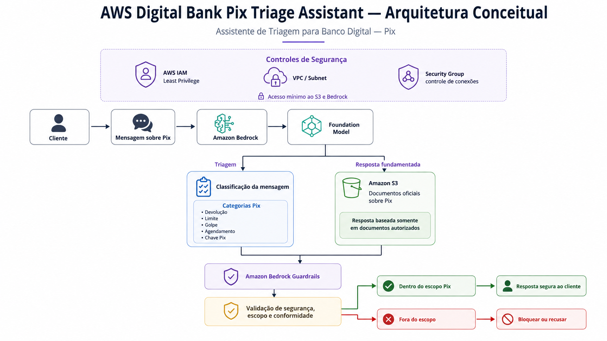

# Assistente de Triagem Pix
# Pix Triage Assistant

> Projeto em andamento / Work in progress

---

# Português

## Why — Por que este projeto existe?

Bancos digitais recebem um grande volume de mensagens sobre Pix, muitas delas relacionadas a limites, devoluções, golpes, agendamentos e chaves.

Responder esse tipo de solicitação com rapidez é importante, mas a resposta também precisa ser consistente, segura e baseada em informações confiáveis.

Este projeto propõe uma base para um assistente de triagem que apoie esse atendimento, ajudando a identificar o assunto da mensagem e a gerar uma resposta inicial com base em documentos oficiais.

O objetivo é reduzir respostas inconsistentes, limitar respostas fora do escopo e demonstrar como controles de segurança podem ser incorporados desde o início da solução.

## What — O que o assistente faz?

O assistente foi desenhado para:

- identificar o tema principal de uma mensagem sobre Pix;
- classificar solicitações em categorias previamente definidas;
- gerar respostas baseadas em documentos públicos e oficiais;
- evitar respostas que não estejam sustentadas pelas informações disponíveis;
- recusar solicitações fora do escopo definido;
- aplicar regras de segurança e conformidade ao fluxo de resposta.

As categorias iniciais do projeto são:

- Devolução
- Limite
- Golpe/Fraude
- Agendamento
- Chave Pix

## Who — Para quem esta solução foi pensada?

A solução representa um cenário de atendimento de um banco digital.

Ela pode apoiar equipes responsáveis pelo primeiro nível de atendimento ao cliente, especialmente em situações em que é necessário:

- identificar rapidamente o assunto da solicitação;
- consultar informações oficiais;
- manter consistência nas respostas;
- encaminhar situações que não devem ser respondidas automaticamente.

Neste projeto, não são utilizados dados reais de clientes.

## How — Como funciona?

O fluxo foi desenhado de forma simples:

Cliente envia uma mensagem sobre Pix  
↓  
O assunto da mensagem é identificado  
↓  
O assistente utiliza informações autorizadas  
↓  
Regras de segurança e conformidade são aplicadas  
↓  
A resposta é apresentada ao cliente

Quando a solicitação não está dentro do escopo do assistente, a resposta deve ser bloqueada ou recusada de forma apropriada.

### Fontes de informação

A base de conhecimento utiliza documentos públicos e oficiais do Banco Central do Brasil relacionados ao Pix.

Os materiais selecionados cobrem temas como:

- experiência do usuário;
- funcionamento das transações;
- resolução de disputas;
- tempos e prazos operacionais.

Esses documentos funcionam como referência para que as respostas sejam baseadas em informações verificáveis.

## How — Como a segurança é tratada?

A solução foi planejada com alguns princípios importantes desde o início:

- utilização apenas de documentos públicos ou autorizados;
- ausência de dados reais de clientes;
- armazenamento dos documentos sem acesso público;
- concessão apenas dos acessos necessários;
- aplicação de controles para reduzir respostas inadequadas;
- recusa de solicitações fora do escopo definido.

A responsabilidade pela segurança é compartilhada.

A AWS é responsável pela infraestrutura dos serviços utilizados.

A Squad é responsável pela configuração segura desses serviços, pelos acessos concedidos, pelos documentos utilizados e pelas regras que definem o comportamento do assistente.

## What — O que está sendo validado?

Durante a Sprint, a Squad valida os principais componentes necessários para essa experiência:

- classificação de mensagens por assunto;
- geração de respostas baseadas em documentos oficiais;
- comportamento do assistente diante de perguntas fora do escopo;
- controles de acesso aos documentos;
- configuração de segurança de rede;
- aplicação de regras de segurança e conformidade.

O objetivo desta etapa não é entregar um sistema bancário completo para produção, mas validar os fundamentos necessários para uma solução futura.

## When — Em que etapa estamos?

O projeto está em desenvolvimento.

A arquitetura conceitual e o escopo do assistente já foram definidos. As diferentes frentes técnicas estão sendo implementadas e documentadas pela Squad.

Os resultados dos testes e as evidências serão adicionados ao projeto conforme cada etapa for concluída.

## Arquitetura conceitual

A arquitetura representa, em alto nível, como os principais componentes do projeto trabalham juntos para receber uma solicitação, identificar seu assunto, utilizar informações oficiais e aplicar controles de segurança antes da resposta.

## Resultado esperado

Ao final da Sprint, a Squad deve demonstrar que o assistente consegue:

- reconhecer o assunto de mensagens relacionadas ao Pix;
- produzir respostas fundamentadas;
- utilizar documentos armazenados de forma segura;
- limitar acessos ao necessário;
- manter respostas dentro do escopo definido;
- recusar solicitações inadequadas ou não suportadas.

---

# English

## Why — Why does this project exist?

Digital banks receive a high volume of Pix-related customer messages, including questions about transaction limits, refunds, fraud, scheduling, and Pix keys.

Responding quickly is important, but those responses also need to be consistent, safe, and based on reliable information.

This project proposes the foundation for a triage assistant that supports customer service by identifying the topic of each message and producing an initial response based on official documentation.

The goal is to reduce inconsistent answers, limit out-of-scope responses, and demonstrate how security controls can be included from the beginning of the solution.

## What — What does the assistant do?

The assistant is designed to:

- identify the main topic of a Pix-related customer message;
- classify requests into predefined categories;
- generate responses based on official public documents;
- avoid answers that are not supported by available information;
- refuse requests outside its defined scope;
- apply security and compliance rules before responding.

The initial categories are:

- Refund
- Transaction Limit
- Fraud/Scam
- Scheduling
- Pix Key

## Who — Who is this solution for?

The solution represents a digital banking customer service scenario.

It can support teams responsible for first-level customer interactions, especially when they need to:

- quickly identify the nature of a request;
- consult official information;
- provide more consistent responses;
- identify situations that should not be answered automatically.

No real customer data is used in this project.

## How — How does it work?

The flow is intentionally simple:

Customer sends a Pix-related message  
↓  
The topic of the message is identified  
↓  
The assistant uses authorized information  
↓  
Security and compliance rules are applied  
↓  
A response is provided to the customer

If the request falls outside the assistant's defined scope, the response should be blocked or safely refused.

### Information sources

The knowledge base uses official public documents from Banco Central do Brasil related to Pix.

The selected materials cover topics such as:

- user experience;
- transaction processing;
- dispute resolution;
- operational timing and deadlines.

These documents provide a reliable reference so that responses can be grounded in verifiable information.

## How — How is security handled?

The solution was designed around several principles from the beginning:

- only public or authorized documents are used;
- no real customer data is included;
- stored documents are not publicly accessible;
- access is limited to what is actually required;
- controls are applied to reduce inappropriate responses;
- requests outside the defined scope are refused.

Security follows a shared responsibility model.

AWS is responsible for the infrastructure supporting the services used in the project.

The Squad is responsible for securely configuring those services, managing access, selecting the documents used, and defining the assistant's behavioral boundaries.

## What — What is being validated?

During the Sprint, the Squad validates the main components required for this experience:

- message classification by topic;
- responses grounded in official documents;
- assistant behavior when receiving out-of-scope requests;
- access control for stored documents;
- network security configuration;
- security and compliance controls.

The purpose of this stage is not to deliver a complete production banking system, but to validate the foundations required for a future solution.

## When — What stage is the project in?

The project is currently in development.

The conceptual architecture and assistant scope have already been defined. The different technical workstreams are being implemented and documented by the Squad.

Test results and supporting evidence will be added as each stage is completed.

## Conceptual Architecture

The architecture provides a high-level view of how the main project components work together to receive a request, identify its topic, use official information, and apply security controls before responding.

## Expected Outcome

By the end of the Sprint, the Squad should demonstrate that the assistant can:

- recognize the topic of Pix-related customer messages;
- generate grounded responses;
- use documents stored securely;
- restrict access to what is necessary;
- keep responses within the defined scope;
- refuse unsupported or inappropriate requests.
