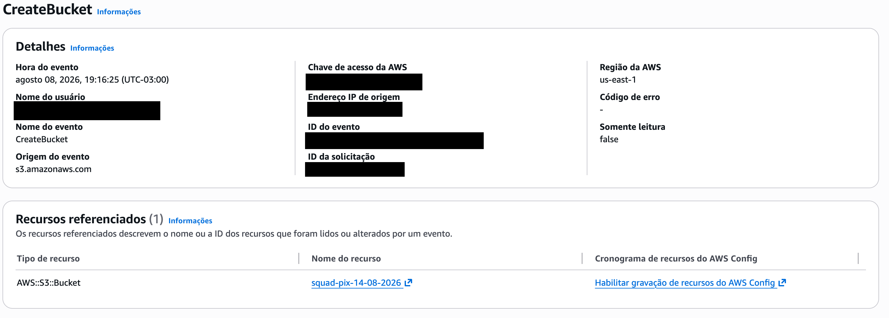
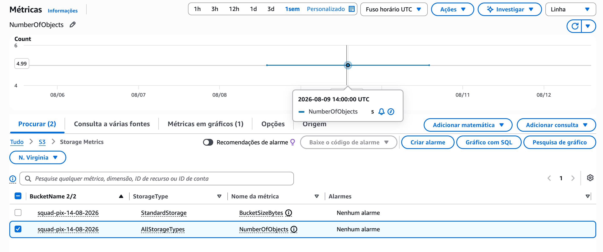
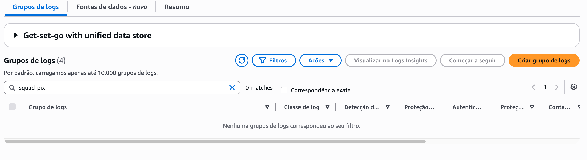

# Evidências de observabilidade

Esta pasta reúne as evidências da análise de custos, auditoria e monitoramento do protótipo Pix na AWS.

As verificações foram realizadas por meio da role `Gerenciamento_Biling_Desafio_Cleidyanne`, configurada para acesso somente leitura.

## CloudTrail

O AWS CloudTrail foi utilizado para auditar eventos de gerenciamento relacionados ao projeto.

A evidência `01-cloudtrail-create-bucket-success-redacted.png` apresenta o evento `CreateBucket`, originado pelo Amazon S3, referente ao bucket `squad-pix-14-08-2026`, na região `us-east-1`. A ausência de código de erro indica que a operação foi concluída com sucesso.

*Figura 1 - Evento de gerenciamento `CreateBucket` registrado com sucesso pelo AWS CloudTrail para o bucket oficial do projeto.*

## CloudWatch Metrics

O Amazon CloudWatch foi utilizado para consultar a métrica `NumberOfObjects` do bucket do projeto.

A evidência `02-cloudwatch-s3-number-of-objects.png` demonstra a quantidade de objetos armazenados no bucket. A consulta foi realizada sem criação de alarmes, dashboards ou outros recursos.

*Figura 2 — Consulta da métrica `NumberOfObjects` do bucket do projeto no Amazon CloudWatch, sem criação de alarmes ou dashboards.*

## CloudWatch Logs

Foi realizada uma busca por um grupo de logs dedicado ao projeto.

A evidência `03-cloudwatch-log-groups-project-filter.png` mostra que não foi identificado um log group associado ao termo `squad-pix`. Nenhum recurso foi criado, respeitando o escopo somente leitura.

A criação de um grupo dedicado e a configuração dos serviços para envio de logs podem ser consideradas em uma evolução futura da solução.

*Figura 3 — Busca por um grupo de logs dedicado ao projeto, sem resultados para o termo `squad-pix`.*

## Billing

A evidência de custos será adicionada após a liberação do acesso de identidades IAM e federadas às informações de faturamento da conta.
